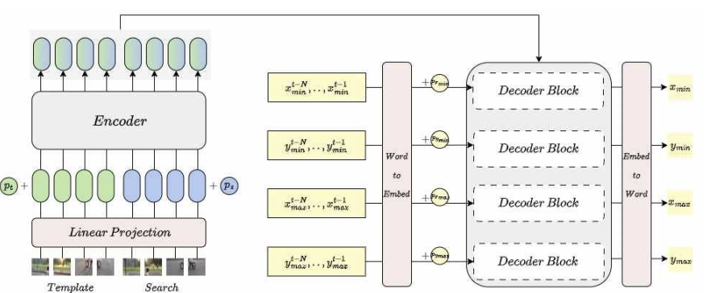

# IDTrack : Independent Sequence Prediction in Decoder for Visual Object Tracking

## Highlights
### IDTrack modeling
IDTrack models tracking as a **Coordinates generation** task. Use image features and historical coordinate values of the target object to predict the current bounding box.

### Model Architecture


### GOT-10k Performance
| Tracker      |      AO      |    SR_0.5    |    SR_0.75    |
|--------------|--------------|--------------|---------------|
| **IDTrack**  |   **73.0**   |   **81.3**   |    **68.5**   |
| ARTrack      |     73.5     |     82.2     |      70.9     |
| OSTrack      |     71.0     |     80.4     |      68.2     |
| MixFormer    |     70.7     |     80.0     |      67.8     |
| TransT       |     67.1     |     76.8     |      60.9     |
| SiamR-CNN    |     64.9     |     72.8     |      59.7     |


## Install the environment
```
conda create -n idtrack python=3.8
conda activate idtrack
bash install.sh
```

## Data Preparation
Put the tracking datasets in ./data. It should look like:
   ```
   # IDTrack uses only got10k dataset.
   ${IDTrack_ROOT}
    -- data
        -- lasot
            |-- airplane
            |-- basketball
            |-- bear
            ...
        -- got10k
            |-- test
            |-- train
            |-- val
        -- coco
            |-- annotations
            |-- images
        -- trackingnet
            |-- TRAIN_0
            |-- TRAIN_1
            ...
            |-- TRAIN_11
            |-- TEST
   ```

   ## Set project paths
   Run the following command to set paths for this project
```
python tracking/create_default_local_file.py --workspace_dir . --data_dir ./data --save_dir .
```
After running this command, you can also modify paths by editing these two files
```
lib/train/admin/local.py  # paths about training
lib/test/evaluation/local.py  # paths about testing
```

## Train IDTrack
Download pre-trained [MAE ViT-Base weights](https://dl.fbaipublicfiles.com/mae/pretrain/mae_pretrain_vit_base.pth) and put it under `$PROJECT_ROOT$/pretrained_models` (different pretrained models can also be used, see [MAE](https://github.com/facebookresearch/mae) for more details).

```
python -m torch.distributed.launch --nproc_per_node 8 lib/train/run_training.py --script idtrack --config idtrack_ts --save_dir .
```

(Optionally) Debugging training with a single GPU
```
python tracking/train.py --script idtrack --config idtrack_ts --save_dir . --mode single
```

## Test and evaluate on benchmarks
- GOT10K-test
```
python tracking/test.py idtrack idtrack_b256_got --dataset got10k_test --threads 2
python lib/test/utils/transform_got10k.py --tracker_name idtrack --cfg_name idtrack_b256_got
```
